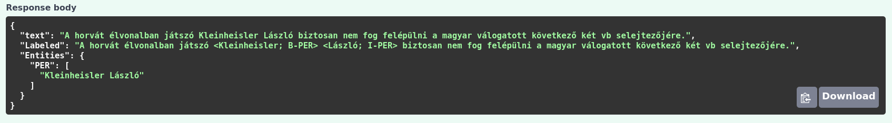
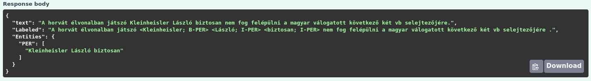

# Egyszerű anonimizálási példa a Digital Twin Distiller segítségével​

## Háttér

A [MONTANA Tudásmenedzsment Kft](https://montana.hu/) által fejlesztett
[digital-twin-distiller](https://github.com/montana-knowledge-management/digital-twin-distiller)
egy szövegbányászatot és numerikus modellezési feladatok fejlesztési folyamatát támogató,
**python** nyelven implementált **számítási platform**, amely megkönnyíti többek között a mesterséges intelligencia
alapú, szövegbányászati, képfelismerési vagy egyéb komplex mérnöki problémák megoldása
során ismétlődő(rész)feladatok szervezését és menedzselését.

A **digitális iker** fogalmát eredetileg a gyártási folyamatok fejlesztése során alkották meg,
ez azonban az utóbbi években átalakult, kitágult, immár többféle definíciója is létezik.
Fő jelentésében az élő és élettelen entitások olyan digitális replikációját értjük alatta, ahol a termék teljes
életciklusa alatt keletkezett adatokat, numerikus szimulációkat, vagy akár a mesterséges
intelligencián alapuló nyelvi modelleket kezelhetjük.

A digital-twin-distiller esetében a **dockerizálásnak** köszönhetően az előállított digitális
ikrek később, akár évek múlva is futtathatók lesznek **a rendszer mélyebb ismerete nélkül**,
ilyen módon pedig segít kiküszöbölni a vállalati kompetencia fluktuációja, valamint a
vendor lock-in és a szoftverkörnyezet változása miatt esetlegesen bekövetkező, üzletmenetbeli
fennakadásokat.


## Egy egyszerű, névelem felismerésen alapuló anonimizálás

Ebben a projektben, egy egyszerű, névelem-felismerésen alapuló anonimizáló alkalmazást mutatunk be, illetve rámutatunk
arra, hogy miért nem elegendő egy jó névelem-felismerő, a GDPR-nak megfelelő erősségű anonimizáláshoz.

A keretrendszer képes bármilyen fájlba menthető illetve onnan beolvasható gépi tanulási modellt kezelni egy
projekten belül, tehát egyaránt alkalmas pl.  \verb|sklearn|, \verb|keras|, \verb|huggingface| stb. alapú modellek
hatékony használatára API-ként, ezáltal lehetőséget biztosít, hogy minimális módosítások elvégzésével a különböző 
módokon elkészült modellek egyaránt használhatóak legyenek.

Két különböző névelemfelismerőt is feltanítottunk, egy *LSTM* alapút, illetve egy *BERT* alapút a hunNerwiki korpuszon.  
Tanításhoz az adatok 80\%-át használtuk, 10\% validálási és 10\% teszthalmaz felosztásban.
Az elkészült modelleket beépítettük a keretrendszerbe, majd ezek segítségével, egy újsághírből kivett mondaton elemeztük a 
különböző módszerek eredményességét. 


<center>
<b>BERT modell által talált entitás</b> <br>

</center>

<center>
<b>LSTM modell által talált entitás</b> <br>

</center>
<br>

Látható, hogy mindkét modell megtalálta Kleinhesler László nevét, de az LSTM modell a biztosan szót is névelemként ismerte fel. 


A példamondat alapján jól látszik, hogy ez a művelet miért nem tekinthető a GDPR-nak megfelelő anonimizálásnak [1]. 
Ehhez egy statisztikai analízisre is szükség lenne, amelynek a segítségével bizonyítható, hogy a szövegben található személy személyazonossága nem ismerhető fel a mondatban található mikroadatokból.

Ismertek ugyanis a következő információk:

    * sportolóról van szó,
    * aki a horvát élvonalban játszik,
    * a magyar válogatott tagja,
    * és vb selejtezőn nem tud részt venni, tehát olyan sportágban, ahol ilyen egyáltalán létezik.

Ezek alapján feltételezve az egyik legnészerűbb sportágat, a labdarúgást, valamint ha ismert, hogy mikor keletkezett a szöveg (2021), könnyen megtalálhatjuk, hogy kiről is van szó, hiszen jelenleg egyetlen labdarúgó játékos van, akire illik ez a leírás (Lovrencsics Gergő ugyanis visszamondta a válogatottságot).


## További eszközök

### Augmentálás

<br>
Különböző augmentálási módszerek működése, alpha=0,5 beállítással - 100 futtatás eredménye. 
* előre elkészített szótár használatával

<center>

| Módszer        | Futási idő [s] | Augmentálás eredménye                                                                                                                                                                                                                                                                                                                                                                                                                                                                                                                                                                                                                                                        | 
|----------------|:---------------|:-----------------------------------------------------------------------------------------------------------------------------------------------------------------------------------------------------------------------------------------------------------------------------------------------------------------------------------------------------------------------------------------------------------------------------------------------------------------------------------------------------------------------------------------------------------------------------------------------------------------------------------------------------------------------------|
| Eredeti mondat | -              | A horvát élvonalban játszó Kleinheisler László biztosan nem fog felépülni a magyar válogatott következő két vb selejtezőjére.
| EDA/RD         | 0,61           | A horvát Kleinheisler László                                                                                                                                                                                                                                                                                                                                                                                                                                                                                                                                              | 
| EDA/RS         | 0, 52          | A felépülni magyar játszó Kleinheisler selejtezőjére. következő biztosan fog vb a élvonalban nem László két horvát válogatott                                                                                                                                                                                                                                                                                                                                                                                                                                                                                                                                                | 
| EDA/RI         | 0,50           | A horvát élvonalban makulátlanul játszó Kleinheisler László biztosan nem ereszt eredő fog felépülni a magyar válogatott következő két vb selejtezőjére.                                                                                                                                                                                                                                                                                                                                                                                                                                                                                                                      | 
| EDA/SI         | 0,46           | A horvát élvonalban játszó Kleinheisler László ügyesen nem ereszt felépülni a magyar válogatott rákövetkező két vb selejtezőjére.                                                                                                                                                                                                                                                                                                                                                                                                                                                                                                                                            | 
| FastText       | 24,92/0,12*    | A horvát élvonalban játszik Kleinheislerről Tamás biztosan nem fogok felépülhet a külföldi válogatott fenti Két vb selejtezőjére.                                                                                                                                                                                                                                                                                                                                                                                                                                                                                                                                            | 
| BERT           | 44,67          | A magyar színekben játszó Tóth már biztosan nehezen fog felépülni a magyar válogatott következő két vb selejtezőjére.                                                                                                                                                                                                                                                                                                                                                                                                                                                                                                                                                                                                                                                                             |

</center>
<br>


## Használat

Az API az adatot JSON formátumban várja, az elemzendő mondatot a "text" attribútum
értékeként megadva:

```
{
  "text": "Példa mondat."
}
```

## Alkalmazott modell

A keretrendszer képes bármilyen fájlba menthető illetve onnan beolvasható gépi
tanulási modellt kezelni egy projekten belül, tehát egyaránt alkalmas pl. `sklearn`,
`keras`, `huggingface` stb. alapú modellek hatékony használatára API-ként.

A jelen implementációban egy ... modell szerepel.

Ábra: F1, stb. (teljesítmény?)

## Kimeneti formátum

IOB2 taggelési formátum?

Elkerülve a monogramok használatát, a rendszer a neveket
„X” karakterre cseréli kizárólag az első karaktert meghagyva
és a rövidítést ponttal jelölve?


## Endpoint-ok

* `/` endpoint-on érhető el ez a dokumentáció.

* `/process` endpoint, ahol az alkalmazás `single input`-ként vájra a JSON-t amelyet címkézve visszaad.

* `/apidocs` endpoint, ahol az alkalmazás OpenAPI dokumentációként leírt működése, valamint teszt interfésze található.

* `/ping` endpoint tesztelhető a szerver elérése.

## Az integrált teszt interfész használata az `/apidocs` endpoint-on


## Referenciák

[1] Csányi, G.M.; Nagy, D.; Vági, R.; Vadász, J.P.; Orosz, T. Challenges and Open Problems of Legal Document Anonymization. Symmetry 2021, 13, 1490. https://doi.org/10.3390/sym13081490 